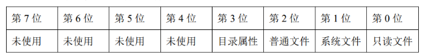

# OS设计文档

## 1. 设计要求
设计一个简单的文件系统，用文件模拟磁盘，用数组模拟缓冲区，要求：
1.  支持多级目录结构，支持文件的绝对读路径；
2.  文件的逻辑结构采用流式结构，物理结构采用链接结构中的显式链接方式；
3.  采用文件分配表 FAT；
4.  实现的命令包括建立目录、列目录、删除空目录、建立文件、删除文件、显示文件内容、打开文件、读文件、写文件、关闭文件、改变文件属性。可以采用命令行界面执行这些命令，也可以采用“右击快捷菜单选择”方式执行命令。
5.  最后编写主函数对所作工作进行测试。

## 2. 具体要求
1. 文件分配表（一张表）
   
    - FAT表所需字段
       - id（0 - 127）
       - 盘状态（-1表示占用，0表示空，其他数字表示指向的下一块磁盘号）
       - 盘内容（具体内容，包括目录，文件内容等，目录用逗号进行分隔，文件内容不需要）
   
2. 磁盘空间管理（一张表？感觉不用，FAT表即可）
    - 128个物理块。一块64B。
    - 从0开始编号
    - 磁盘的前三块一定会被占用，任何文件或者目录的存储都从第3块开始
      - 0,1 -> FAT
      - 2 -> 根目录

3. 文件（文件专门一张表）
   - 目录包括：
     1. 文件名（3Byte）：实验中合法文件名仅可以使用字母、数字和除“$”、“.”、“/”以外 的字符，第一个字节的值为“$”时表示该目录为空目录项，文件名和类型名之间用“.”分割，用“/”作为路径名中目录间分隔符
     2. 文件类型（2Byte）
     3. 文件属性（1Byte）：里面的每一bit表示含义，若第3位为1，则表示这是个目录
        
     4. 文件的起始盘块号（1Byte）
     5. 文件长度（1Byte）：为了实验的简单，假设文件长度单位为盘块（几块）
   - 文件内容正文（比如长度为2，意思为整个文件不能超过128B【包括目录】）
   - 文件表所需字段
     1. 文件路径名（绝对路径）
     2. 文件属性（查看上面文件属性图）
     3. 起始盘块号
     4. 文件长度（块）
     5. 操作类型（0 -> 读，1 -> 写）
     6. 读文件的位置
         - 磁盘盘块号dnum
         - 磁盘的第几字节bnum（打开时dnum = 文件起始盘块号，bnum = 0）
     7. 写文件的位置
         - 磁盘盘块号dnum
         - 磁盘的第几字节bnum（文件建立时dnum = 文件起始盘块号，bnum = 0）（打开文件时dnum = bnum = 文件末尾位置）
   
4. 根目录和子目录
   - 根目录（固定位置，固定大小【1盘块】，里面可以登记子目录或者文件） + 子目录（任意磁盘空闲位置，一个子目录都是1盘块大小，一个子目录里面最多放8个目录项【8x8B】）
       - 目录登记项：
           1. 目录名（3B）要求同文件名
           2. 空（2B）：填写空格来占位
           3. 目录属性（1B）：里面的每一bit表示含义，若第3位为1，则表示这是个目录
                
           4. 起始盘块号（1B）
           5. 空（1B）：填写0来占位

5. 文件操作
   1. 创建文件（create_file）
   2. 打开文件（open_file）
   3. 读文件（read_file）
   4. 写文件（write_file）
   5. 关闭文件（close_file）
   6. 删除文件（delete_file）
   7. 显示文件内容（typefile）
   8. 改变文件属性（change）

6. 目录操作
   1. 创建目录（md）
   2. 显示目录内容（dir）
   3. 删除空目录（rd）

